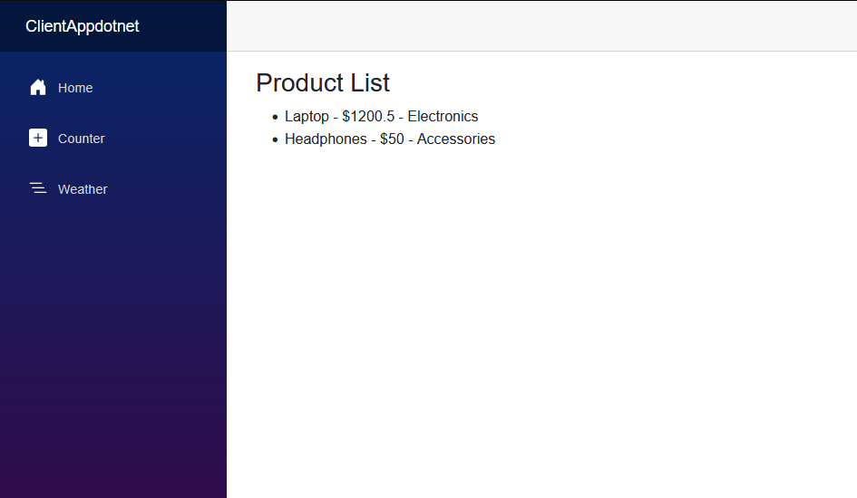

# FullStackApp




This is a simple full stack application built with:
- **Blazor WebAssembly** (frontend)
- **ASP.NET Core Minimal API** (backend)

## Features
- Fetches and displays a list of products from a backend API
- Demonstrates CORS configuration for local development
- Shows how to handle nested objects in API responses

## Project Structure
- `ClientAppdotnet/` — Blazor WebAssembly frontend
- `ServerApp/` — ASP.NET Core backend API

## Getting Started

### Prerequisites
- [.NET 9 SDK](https://dotnet.microsoft.com/download)

### Running the Backend
1. Open a terminal in `FullStackApp/ServerApp`
2. Run:
   ```
   dotnet run
   ```
   The API will be available at `http://localhost:5253/api/productlist`

### Running the Frontend
1. Open a terminal in `FullStackApp/ClientAppdotnet`
2. Run:
   ```
   dotnet run
   ```
   The app will be available at `http://localhost:5140`

### Usage
- Navigate to `/fetchproducts` in the frontend to see the product list.

## Development Notes
- CORS is enabled in the backend to allow requests from the frontend port.
- The frontend expects the API to return products with a nested `Category` object.

## Copilot Usage Summary
GitHub Copilot was used to:
- Diagnose and resolve API and CORS issues
- Update code to match backend changes
- Add code comments and documentation
- Provide step-by-step guidance for configuration and best practices

---
